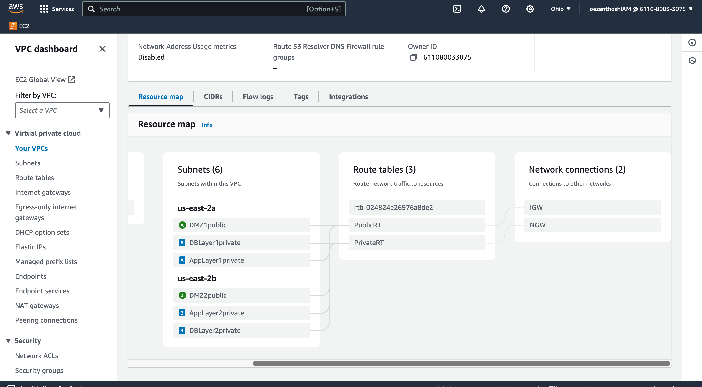
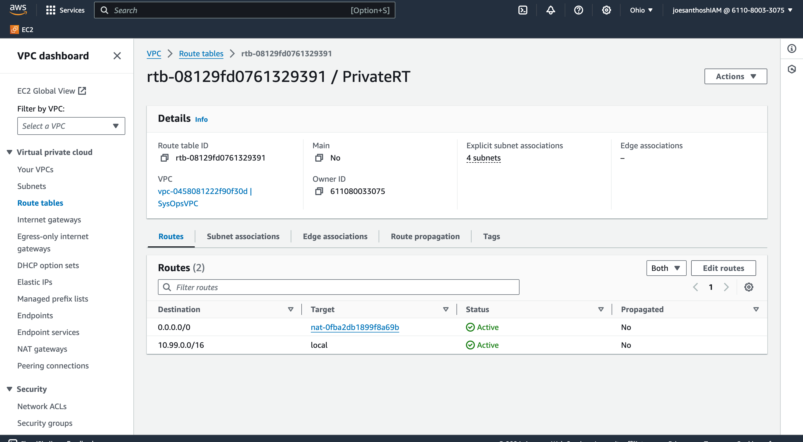

# Three tier VPC

Terraform code to build 3 tier network VPC from scratch.
Contains 1 VPC, 2 public subnets, 4 private subnets, internet gateway, nat gateway, route tables, network access controls.

## Subnet Associations on Route Table

## Routes

### Route to Connect Public Subnets to Internet using Internet Gateway

### Route to Connect Private Subnets to Internet using NAT Gateway

